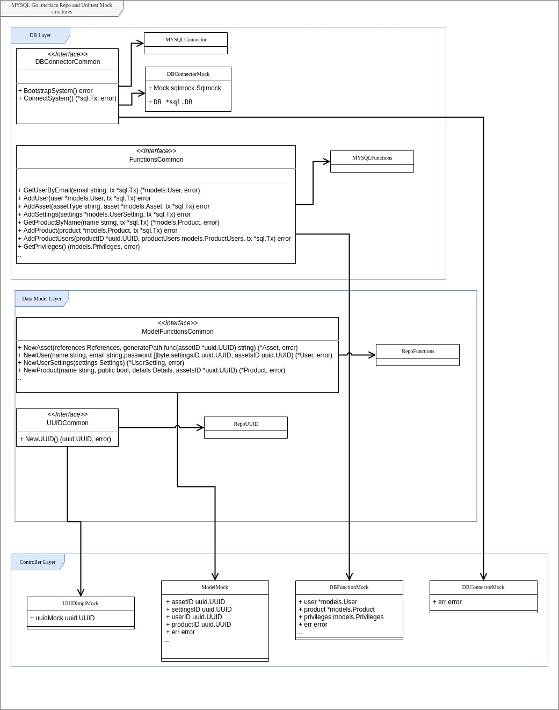

# Example implementation for user/product/project and high volume data store using MYSQL and Golang

NOTE: This implementation is heavily under development, but is in a usable state. Feel free to try, raise tickets and fix bugs.

This example implementation provides a fundamental handling of a user database. The users can have products, projects and project associated data viewers.
All content of each object type (user/product/project) is fully customizable using two json columns.

The database can be used as a **store for webshops, platforms that allow users to create projects or applications that require high volume data collection.**

- Users table
  ```
  +------------------+---------------+------+-----+-------------------+-------------------+
  | Field            | Type          | Null | Key | Default           | Extra             |
  +------------------+---------------+------+-----+-------------------+-------------------+
  | id               | binary(16)    | NO   | PRI | NULL              |                   |
  | name             | varchar(50)   | NO   | UNI | NULL              |                   |
  | email            | varchar(300)  | NO   | UNI | NULL              |                   |
  | password         | varchar(1024) | YES  |     | NULL              |                   |
  | user_settings_id | binary(16)    | YES  | MUL | NULL              |                   |
  | user_assets_id   | binary(16)    | YES  | MUL | NULL              |                   |
  | created_at       | datetime      | NO   |     | CURRENT_TIMESTAMP | DEFAULT_GENERATED |
  | updated_at       | datetime      | NO   |     | CURRENT_TIMESTAMP | DEFAULT_GENERATED |
  +------------------+---------------+------+-----+-------------------+-------------------+
- Products table
  ```
  +--------------------+--------------+------+-----+-------------------+-------------------+
  | Field              | Type         | Null | Key | Default           | Extra             |
  +--------------------+--------------+------+-----+-------------------+-------------------+
  | id                 | binary(16)   | NO   | PRI | NULL              |                   |
  | name               | varchar(255) | NO   | UNI | NULL              |                   |
  | product_details_id | binary(16)   | YES  | MUL | NULL              |                   |
  | product_assets_id  | binary(16)   | YES  | MUL | NULL              |                   |
  | created_at         | datetime     | NO   |     | CURRENT_TIMESTAMP | DEFAULT_GENERATED |
  | updated_at         | datetime     | NO   |     | CURRENT_TIMESTAMP | DEFAULT_GENERATED |
  +--------------------+--------------+------+-----+-------------------+-------------------+
- Projects table
  ```
  +--------------------+------------+------+-----+-------------------+-------------------+
  | Field              | Type       | Null | Key | Default           | Extra             |
  +--------------------+------------+------+-----+-------------------+-------------------+
  | id                 | binary(16) | NO   | PRI | NULL              |                   |
  | products_id        | binary(16) | NO   | MUL | NULL              |                   |
  | project_details_id | binary(16) | YES  | MUL | NULL              |                   |
  | project_assets_id  | binary(16) | YES  | MUL | NULL              |                   |
  | created_at         | datetime   | NO   |     | CURRENT_TIMESTAMP | DEFAULT_GENERATED |
  | updated_at         | datetime   | NO   |     | CURRENT_TIMESTAMP | DEFAULT_GENERATED |
  +--------------------+------------+------+-----+-------------------+-------------------+
  
# Usage
It is recommended to call only the dbcontrollers functions using it in third party code.

## Build
- Run ```docker-compose up --build --force-recreate -d main-server``` to generate and start all containers.
- In order to access the db run: ```docker exec -it user-db bash -c "mysql -uroot -p123secure user_database```
- To run bootstrap/migration in your code, the migration files need to be copied manually from the db folder. The destination shall be the root of the golang source.
  Example docker file code:
  ```
  RUN git clone https://github.com/artofimagination/mysql-user-db-go-interface /tmp/mysql-user-db-go-interface && \
  cp -r /tmp/mysql-user-db-go-interface/db $GOPATH/src/my-app && \
  rm -fr /tmp/mysql-user-db-go-interface
- .env.example contains an example docker config that is required to run the code as intended. Rename it to .env and customize as needed.

## Running the example code
To run functional testing using the example code run ```./runFunctionalTest.sh```
Note: Functional testing requires python 3.8 or newer

Once the example main-server is running the user can do the following using the curl command:
User commands
- add new user (will print the created user UUID): ```curl -i -X POST -H 'Content-Type: application/json' -d '{ "name": "test", "email": "test@test.com","password": "test"}' http://localhost:8080/add-user```
- get user by id (UUID): ```curl -i -X GET http://localhost:8080/get-user?id=c34a7368-344a-11eb-adc1-0242ac120002```
- get user by email: ```curl -i -X GET http://localhost:8080/get-user-by-email?email=test@test.com```
- get multiple users: ```curl -i -X GET http://localhost:8080/get-users?ids=c34a7368-344a-11eb-adc1-0242ac120002,c34a7368-344a-11eb-adc1-0242ac120002```
- update user settings: ```curl -i -X POST -H 'Content-Type: application/json' -d '{ "user": {"name": "test","email": "test", "password": "test", "Settings": {"DataMap":{ "test_entry":"test_data" }}}}' http://localhost:8080/update-user-assets```
- update user assets: ```curl -i -X POST -H 'Content-Type: application/json' -d '{ "user": {"name": "test","email": "test", "password": "test", "Settings": {"DataMap":{ "test_entry":"test_data" }}}}' http://localhost:8080/update-user-settings```
- delete user (and nominate new product owners if defined): ```curl -i -X POST -H 'Content-Type: application/json' -d '{"id": "c34a7368-344a-11eb-adc1-0242ac120002", "nominees":["c34a7368-344a-11eb-adc1-0242ac120002", "c34a7368-344a-11eb-adc1-0242ac120002"]}' http://localhost:8080/delete-user```
- authenticate: ```http://localhost:8080/authenticate?id=c34a7368-344a-11eb-adc1-0242ac120002&email=test@test.com&password=testPass```

Product commands

# Database
## Entity relation

## UML

## dbcontrollers use cases


